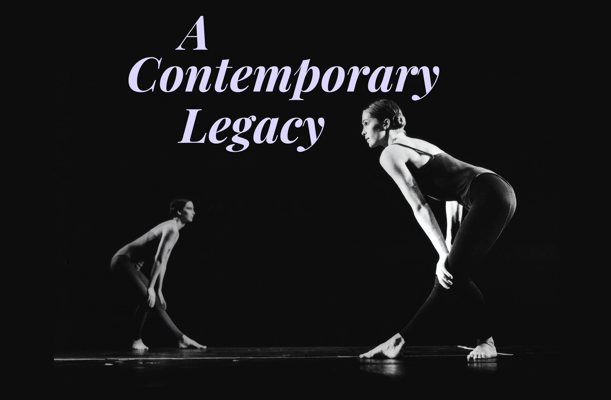

# 🩰 Kilda Mori Northcott, MNZM — Living Legacy Archive

  <br><br>
  
  <br><br>

  ### To vist the website click the link bellow 👇
  ### 🌐 https://drfta.github.io/kilda-northcott/

> *"The body is a vessel of memory. Every movement I make today carries the echo of the marae floor in 1977, the rehearsal studios of Sydney in the 80s, and the cinematic landscapes of the present."*

---

## 📖 About This Project

This is a digital preservation archive dedicated to **Kilda Mori Northcott MNZM**, one of the most influential figures in the history of contemporary dance in Aotearoa New Zealand.

The archive presents a comprehensive, interactive exploration of Kilda's five-decade career — from her early training in classical ballet, through her founding role in **Limbs Dance Company**, her transformative collaboration with **Douglas Wright**, to her ongoing work as a mentor and advocate for mature performers.

---

## 🎯 Key Features

- **📜 Living History Biography** — An extensive, narrative-driven account of Kilda's career and impact.
- **🎨 Interactive Artistic Eras** — Explore five distinct periods of her creative journey with dynamic content panels.
- **📊 Creative Velocity Chart** — Visual representation of production output by decade using Chart.js.
- **📋 Performance Catalog** — Searchable, sortable table of works, choreographers, and performance contexts.
- **🖼️ Visual Heritage Gallery** — Curated collection of archival images with full-screen modal viewing.
- **🎨 Responsive Design** — Beautifully crafted with Tailwind CSS and custom styling.

---

## 🛠️ Technologies Used

| Technology | Purpose |
|------------|---------|
| **HTML5** | Structure & content |
| **CSS3** | Custom styling & animations |
| **Tailwind CSS** | Utility-first responsive design |
| **JavaScript (ES6)** | Interactivity & state management |
| **Chart.js** | Data visualization |
| **Google Fonts** | Playfair Display & Inter typefaces |

---

## 🗂️ Project Structure

```
kilda-northcott/
├── index.html              # Main archive page
├── photos/                 # Image gallery
│   ├── KildaYoung.jpg
│   ├── kildadebbie.jpg
│   ├── limbs01.jpg
│   ├── nlnzKilda.jpg
│   └── ... (29+ archival images)
└── README.md              # This file
```

---

## 🚀 Getting Started

### Clone the repository
```bash
git clone https://github.com/yourusername/kilda-northcott.git
cd kilda-northcott
```

### Open the archive
Simply open `index.html` in your browser. No build tools or dependencies required — everything loads from CDN.

```bash
open index.html
# or double-click the file in your file explorer
```

---

## 📊 Data Sources

- **Performance Catalog** — Compiled from historical records, programs, and archival documentation.
- **Eras Information** — Curated from interviews, biographies, and dance history publications.
- **Image Archive** — Sourced from personal collections and public archives.

---

## 🎨 Design Palette

| Color | Hex | Usage |
|-------|-----|-------|
| Midnight Slate | `#0f172a` | Background |
| Pastel Mint | `#99f6e4` | Primary accent |
| Pastel Lavender | `#ddd6fe` | Secondary accent |
| Pastel Peach | `#fed7aa` | Tertiary accent |
| Text Main | `#f8fafc` | Primary text |

---

## 📱 Responsive Breakpoints

- **Mobile-first** design
- **Tablet**: `md:` (768px) — two-column layouts
- **Desktop**: `lg:` (1024px) — expanded content

---

## 🔍 Interactive Elements

### 1. Artistic Eras
Click any era button to dynamically update:
- Era title and description
- Key collaborators
- Primary location

### 2. Performance Catalog
- Search by work name or choreographer
- Instant filtering of table rows

### 3. Image Gallery
- Click any thumbnail for full-screen view
- Lazy loading for performance

---

## 📝 Content Overview

### Biography Sections
- Early life and classical training
- New York years — Cunningham & Limón
- Founding of Limbs Dance Company
- The Douglas Wright collaboration
- Bipeds Productions & mature performers
- MNZM recognition
- Legacy and impact

### Artistic Eras
1. **1977–1983** — Limbs Dance Company
2. **1983–1989** — The Sydney Transition
3. **1989–2003** — The Douglas Wright Muse
4. **2003–2010** — Bipeds & Pedagogy
5. **2010–Present** — Screen Dance Maturity

### Performance Catalog (Selected Works)
| Work | Year | Choreographer | Context |
|------|------|---------------|---------|
| Reptile | 1977 | Chris Jannides | Limbs Founding Tour |
| Walking on Thin Ice | 1986 | Douglas Wright | Sydney / Auckland |
| How on Earth | 1989 | Douglas Wright | Aotea Centre Premiere |
| Buried Venus | 1996 | Douglas Wright | Lead Ensemble |
| The Sea Inside Her | 2024 | Alyx Duncan | Short Film |

---

## 🌟 Acknowledgments

- **Kilda Mori Northcott MNZM** — For her extraordinary contribution to dance and for inspiring this project.
- **Limbs Dance Company** — For pioneering contemporary dance in New Zealand.
- **Douglas Wright Dance Company** — For the profound creative partnership.
- **Alyx Duncan** — For continuing to collaborate and document mature artistry.
- **All photographers and archivists** — For preserving these visual records.

---

## 📄 License

This project is for educational and archival purposes. All content is used with respect to the legacy of Kilda Mori Northcott.

---

## 🤝 Contributing

This is a preservation project. If you have additional archival materials, corrections, or context to contribute, please open an issue or submit a pull request.

---

## 📬 Contact

For questions or contributions:
- **Email**: your-email@example.com
- **GitHub**: [yourusername](https://github.com/yourusername)

---

> *"From a young ballet student in Kawerau to a pioneering founder of Limbs Dance Company, from the experimental studios of New York to the groundbreaking works of Douglas Wright, and from performer to mentor and champion of mature artists, Northcott's legacy is inseparable from the history of contemporary dance in Aotearoa."*

---

**Made with ❤️ for the preservation of New Zealand dance heritage.**
